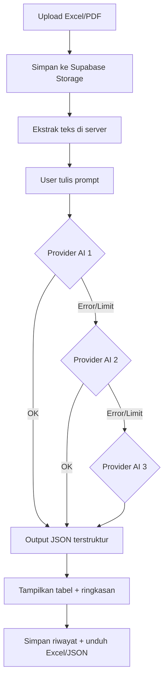

# PRD — TerasOps

> Product Requirement Document
> Aplikasi web terpadu: Otomasi Data, Stok Opname Material, dan Sales Service

## 1. Ringkasan Eksekutif

**TerasOps** adalah aplikasi web terpadu untuk perusahaan dagang/distributor material yang menggabungkan tiga kebutuhan operasional — pengolahan data laporan otomatis berbantuan AI, stok opname material, dan manajemen sales service — ke dalam satu sistem.

Aplikasi dibangun dengan **Next.js** (frontend + API) dan **Supabase** (PostgreSQL + Auth + Storage) sebagai backend, sebagai proyek magang sekaligus prototype produk nyata.

## 2. Latar Belakang & Masalah

| Masalah | Dampak |
| --- | --- |
| Pengolahan laporan Excel/PDF masih copy-paste manual | Lambat, rawan salah input |
| Hitung selisih stok fisik vs sistem manual | Sulit audit, sering keliru |
| Komplain / after-sales tidak terlacak | Status penanganan tidak jelas |

## 3. Tujuan

- Mempercepat ekstraksi data dokumen (Excel/PDF) dengan AI tanpa copy-paste.
- Otomatisasi perhitungan selisih stok opname dan ekspor ke Excel.
- Pelacakan status layanan purna jual secara transparan.

## 4. Persona & Cakupan

- **Admin / Staf** (single role untuk prototype, dengan Supabase Auth).
- **Out of scope:** multi-tenant penuh, RBAC granular, integrasi akuntansi, mobile app.

## 5. Kebutuhan Fungsional

### FR1 — Otomasi Data

- FR1.1 Upload dokumen Excel (`.xlsx`) dan PDF (maks. 10 MB).
- FR1.2 Sistem mengekstrak teks/tabel di server (Excel → markdown table, PDF → teks).
- FR1.3 Pengguna menulis prompt (instruksi pengolahan).
- FR1.4 Sistem memanggil model AI dengan **fallback berantai** (provider utama → fallback berikutnya jika error/limit).
- FR1.5 Output AI dipaksa berformat JSON terstruktur (zod) dan ditampilkan sebagai tabel + ringkasan.
- FR1.6 Riwayat proses tersimpan; hasil dapat diunduh ke Excel/JSON.

### FR2 — Stok Opname Material

- FR2.1 Master barang (kode, nama, unit, kategori, stok sistem, stok minimum).
- FR2.2 Buat sesi opname per tanggal.
- FR2.3 Input stok fisik; sistem menghitung `selisih = fisik − sistem` otomatis.
- FR2.4 Badge status selisih (lebih / kurang / sesuai).
- FR2.5 Pencarian + filter kategori; ekspor hasil opname ke Excel.

### FR3 — Sales Service

- FR3.1 CRUD klien (nama, perusahaan, telepon, email).
- FR3.2 CRUD tiket layanan (nomor tiket otomatis, jenis layanan, deskripsi).
- FR3.3 Status: **Pending → Diproses → Selesai**.
- FR3.4 Timeline riwayat perubahan status.
- FR3.5 Filter berdasarkan status.

## 6. Kebutuhan Non-Fungsional

- **Keamanan API key:** semua key AI & service role hanya di server (`.env.local`), tidak pernah dikirim ke browser, tanpa prefix `NEXT_PUBLIC_` pada key rahasia.
- **Keamanan data:** Supabase RLS — data hanya bisa diakses pemiliknya.
- **Performa:** ekstraksi dibatasi baris (mis. 200 baris Excel) agar token AI terkendali.
- **UI/UX:** tema biru gelap + putih, responsif, tanpa emoji (React Icons), tanpa elemen AI-slop (garis tebal di pinggir card, gradasi berlebihan).
- **Ketersediaan:** fallback provider AI menjamin sistem tetap jalan jika satu provider error/limit.

## 7. Alur Utama (Flow)

## 8. Arsitektur AI (Fallback Berantai)

- Provider dibaca dari env secara berurutan: `AI_PROVIDER_1_*`, `AI_PROVIDER_2_*`, dst.
- Adapter: OpenRouter (OpenAI-compatible, via OpenAI SDK `baseURL` override) dan Google Gemini (`@google/generative-ai`).
- Ekstraksi dilakukan **sebelum** AI (model teks murni seperti Llama tak bisa baca file mentah).
- Log mencatat `provider_used` + `model_used` (bukan API key).

## 9. Kriteria Sukses

- Dokumen terproses < 30 detik untuk file contoh.
- Selisih opname selalu benar & konsisten.
- Status tiket selalu terlacak dengan timeline.
- Tidak ada API key yang bocor ke client (verifikasi Network tab).
